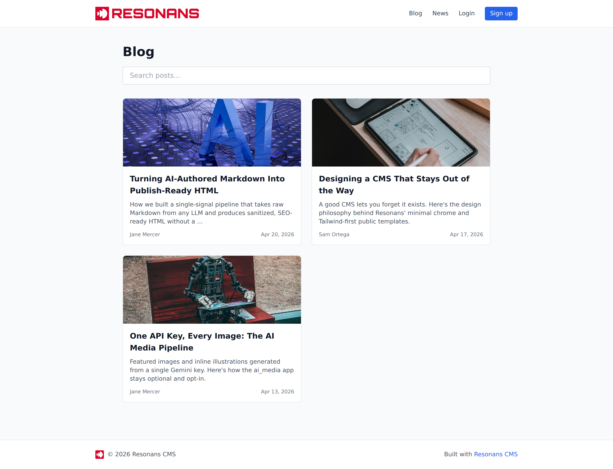
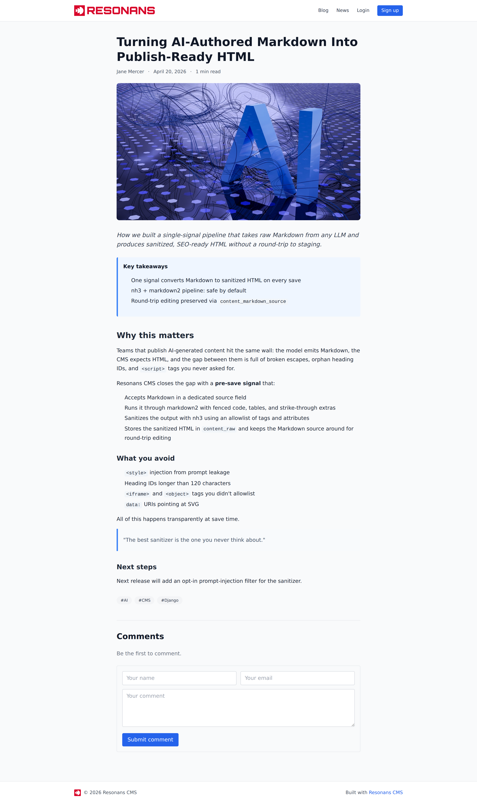
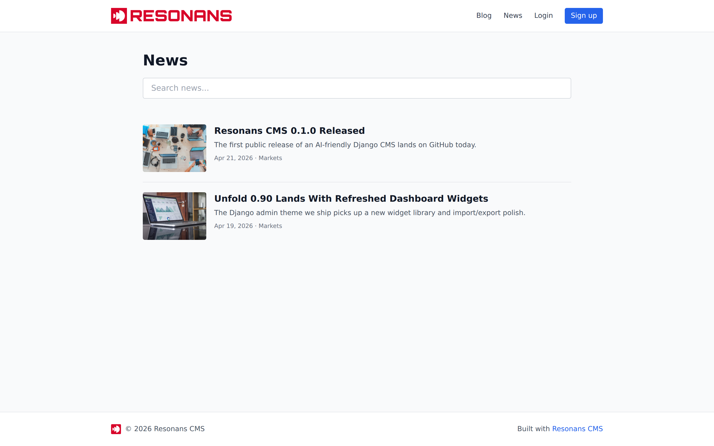
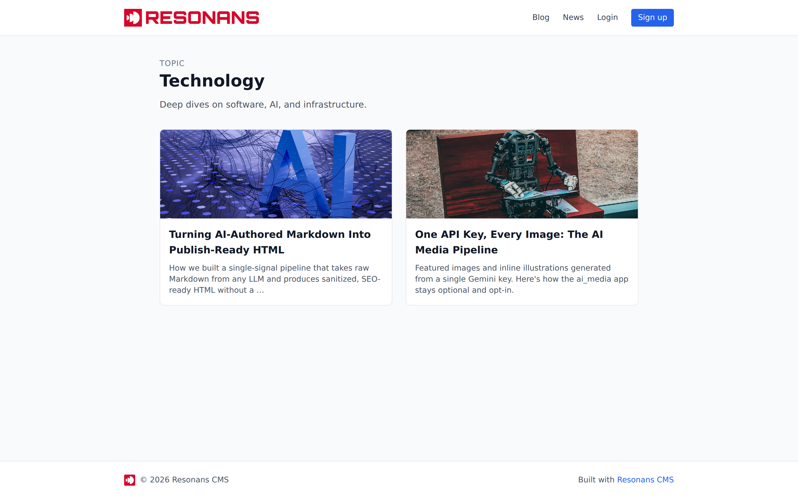
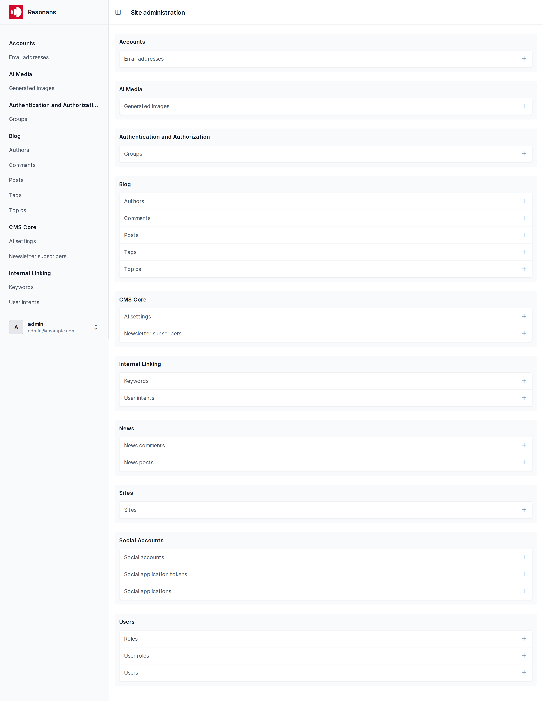
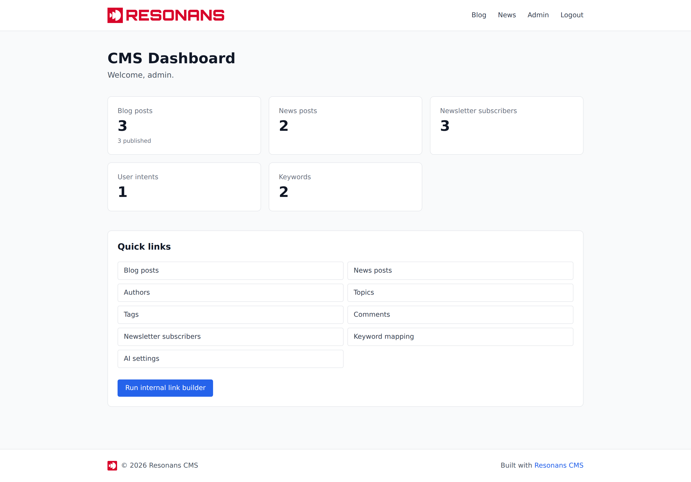
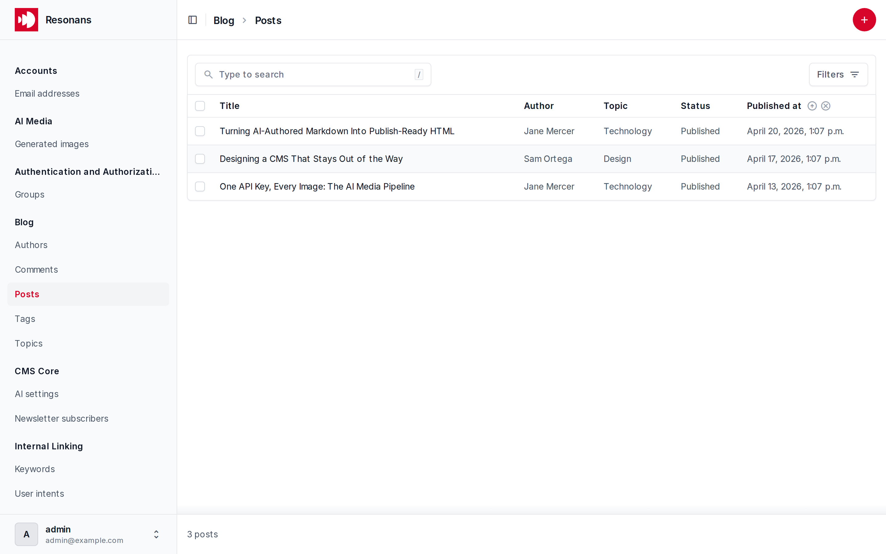
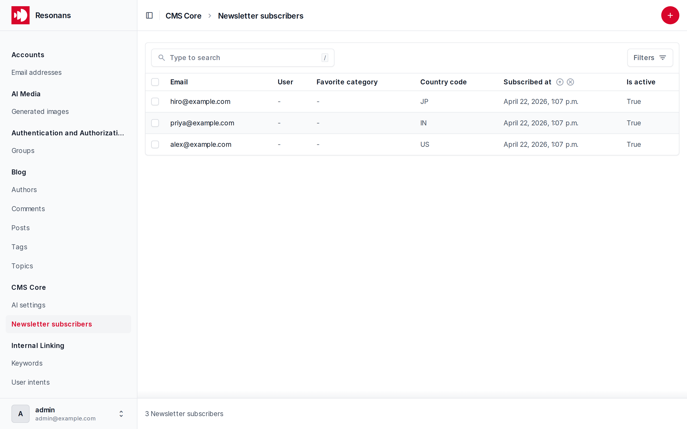

<p align="center">
  
</p>

# Resonans CMS

An AI-friendly Django content management system for building content-driven websites.

Bring your own API key and the CMS turns AI-authored Markdown into sanitized, SEO-ready HTML and generates featured and inline images on demand. Ships as a pip-installable package with the features most blogs and publications need:

- **Blog and News** — Markdown-authored posts with categories, tags, authors, featured images, and threaded comments
- **Taxonomy** — shared `Tag` model and scoped `Category` (blog vs. news)
- **Internal linking** — keyword → URL mapping that auto-links published content
- **Newsletter** — email subscribers with optional user linking
- **AI image generation** — optional Gemini-powered featured and inline image generation
- **User management** — custom User model with email login, Google OAuth via `django-allauth`, and admin role/permission management
- **Admin UI** — polished CMS dashboard built on top of [django-unfold](https://github.com/unfoldadmin/django-unfold)

## Screenshots

### Public pages

| Blog list | Blog post |
|---|---|
|  |  |

| News list | Topic page |
|---|---|
|  |  |

### Admin and CMS dashboard

| Django admin (Unfold) | CMS dashboard |
|---|---|
|  |  |

| Post list | Newsletter subscribers |
|---|---|
|  |  |

## Installation

```bash
pip install resonans-cms
```

## Quick start

1. Create a Django project:

   ```bash
   django-admin startproject myproject
   cd myproject
   ```

2. Install and configure:

   ```bash
   pip install resonans-cms
   ```

3. In `myproject/settings.py`, add the Resonans apps:

   ```python
   from resonans_cms.conf import apply_cms_defaults

   apply_cms_defaults(globals())
   ```

4. Include the URLs in `myproject/urls.py`:

   ```python
   from django.contrib import admin
   from django.urls import include, path

   urlpatterns = [
       path("admin/", admin.site.urls),
       path("accounts/", include("allauth.urls")),
       path("cms/", include("resonans_cms.apps.cms_admin.urls")),
       path("blog/", include("resonans_cms.apps.blog.urls")),
       path("news/", include("resonans_cms.apps.news.urls")),
   ]
   ```

5. Migrate and create a superuser:

   ```bash
   python manage.py migrate
   python manage.py createsuperuser
   python manage.py runserver
   ```

Visit `http://localhost:8000/cms/` to see the admin dashboard and `/blog/` for the public site.

## Demo content

Want to see the CMS populated? Run the bundled seed command after migrating:

```bash
python manage.py seed_demo --reset
```

That creates two authors, three blog posts, two news articles, a newsletter list, and an internal-linking intent — the same content shown in the screenshots above.

## Optional features

- **AI image generation**: `pip install resonans-cms[ai]` and set `GEMINI_API_KEY` in your environment
- **Background auto-linking**: `pip install resonans-cms[celery]` to run the keyword linker on a schedule

## Development

```bash
git clone https://github.com/miladsafaei-me/resonans-cms.git
cd resonans-cms
python -m venv .venv && source .venv/bin/activate
pip install -e ".[dev,ai,celery]"
cd demo
python manage.py migrate
python manage.py seed_demo
python manage.py createsuperuser
python manage.py runserver
```

## License

MIT — see [LICENSE](LICENSE).
